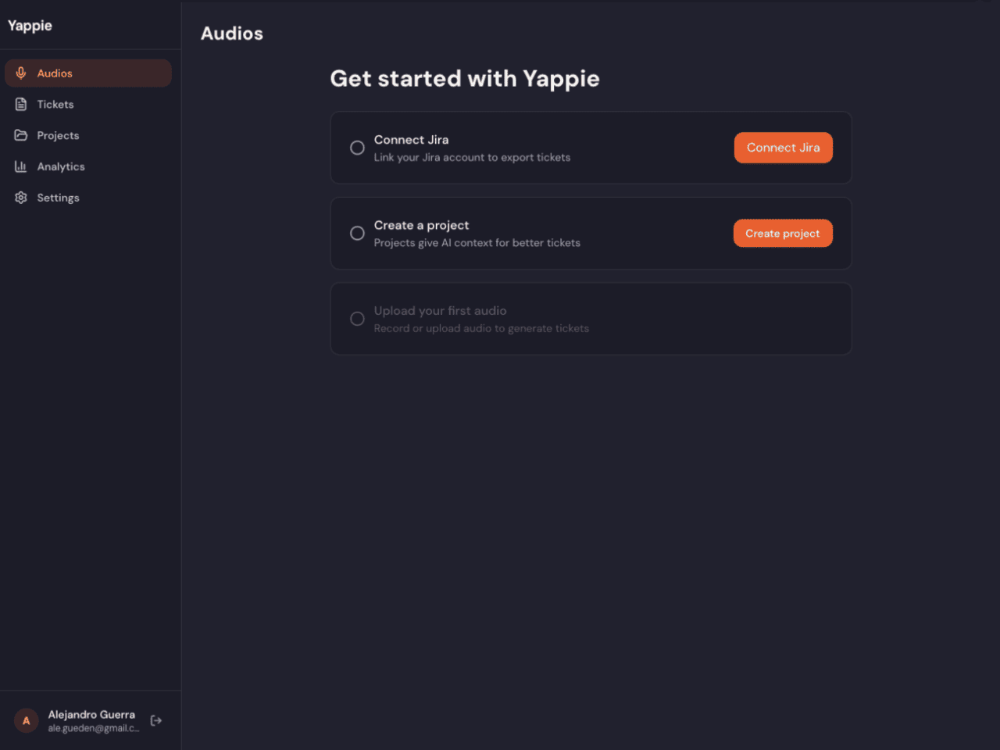

<div align="center">

# Yappie

**Turn voice notes into Jira tickets with AI**

Record your thoughts after a meeting, standup, or brainstorm. Yappie uses AI to extract tasks, generate structured tickets, and export them to Jira — in seconds.

[](https://github.com/alegd/yappie/actions/workflows/ci.yml)
[](LICENSE)

**[Live Demo](https://yappie.gueden.com)** | **[API](https://api.yappie.gueden.com/health)** | **[Slides](https://yappie.gueden.com/presentation)**




</div>

---

## How it works

1. **Record or Upload** — Capture a voice note or upload an audio file (MP3, WAV, OGG, WebM)
2. **AI Decomposes Tasks** — OpenAI Whisper transcribes the audio, then GPT extracts actionable tasks and generates structured tickets with priorities
3. **Export to Jira** — Review, edit, approve, and export tickets to Jira with one click. Bulk export supported.

## Features

- **Passwordless auth** — Sign in with email OTP. No passwords to remember or reset.
- **AI-powered pipeline** — Audio transcription (Whisper) + task decomposition + ticket generation (GPT)
- **Project context** — Describe your project so AI generates better, more relevant tickets
- **Real-time updates** — WebSocket notifications during audio processing
- **Jira integration** — OAuth 2.0 connection, one-click export, bulk export
- **Quota system** — Free and Pro plans with rolling 30-day billing cycles
- **Templates** — Reusable ticket templates for consistent output
- **Analytics** — Track audio uploads, tickets generated, and exports
- **Dark/light theme** — System-aware with manual toggle
- **Internationalization** — next-intl ready (English default)

## Tech Stack

| Layer        | Technology                                                               |
| ------------ | ------------------------------------------------------------------------ |
| **Frontend** | Next.js 16, React 19, Tailwind CSS 4, NextAuth v5, SWR                   |
| **Backend**  | NestJS 11, Prisma 7, PostgreSQL 16, Redis 7, BullMQ                      |
| **AI**       | OpenAI Whisper (transcription), GPT-4o (task decomposition + generation) |
| **Email**    | Resend (passwordless OTP delivery)                                       |
| **Infra**    | Docker, Vercel (web), Coolify (API), GitHub Actions CI                   |
| **Testing**  | Vitest, Testing Library, Playwright (E2E)                                |

## Monorepo Structure

```
yappie/
├── apps/
│   ├── api/                  # NestJS backend (REST + WebSocket + BullMQ)
│   │   ├── src/
│   │   │   ├── auth/         # Passwordless OTP + JWT + refresh tokens
│   │   │   ├── audio/        # Upload, BullMQ pipeline, WebSocket
│   │   │   ├── tickets/      # CRUD + approve + export
│   │   │   ├── projects/     # CRUD + AI context
│   │   │   ├── ai/           # OpenAI Whisper + GPT integration
│   │   │   ├── integrations/ # Jira OAuth + export
│   │   │   ├── email/        # Resend OTP service
│   │   │   ├── redis/        # ioredis client module
│   │   │   ├── quotas/       # Usage tracking + plan limits
│   │   │   ├── analytics/    # Event tracking
│   │   │   ├── templates/    # Ticket templates
│   │   │   └── users/        # Profile management
│   │   └── prisma/           # Schema + migrations
│   └── web/                  # Next.js frontend (App Router)
│       ├── src/
│       │   ├── app/          # Routes (thin pages)
│       │   ├── features/     # Feature modules (auth, audio, tickets, etc.)
│       │   ├── components/   # Shared UI components
│       │   └── lib/          # API fetchers, utils, constants
│       └── e2e/              # Playwright E2E tests
├── packages/
│   ├── shared/               # Shared types and constants
│   └── config/               # ESLint, TypeScript, Vitest configs
├── docker-compose.prod.yml   # Production: API + Postgres + Redis
└── .github/workflows/ci.yml  # CI: lint, type-check, test, build
```

## Getting Started

### Prerequisites

- Node.js 22+
- pnpm 10+
- PostgreSQL 16
- Redis 7
- OpenAI API key
- Resend API key

### 1. Clone and install

```bash
git clone https://github.com/alegd/yappie.git
cd yappie
pnpm install
```

### 2. Configure environment

```bash
cp apps/api/.env.example apps/api/.env
# Edit apps/api/.env with your values
```

Key environment variables:

| Variable                                                  | Description                                          |
| --------------------------------------------------------- | ---------------------------------------------------- |
| `DB_HOST`, `DB_PORT`, `DB_USER`, `DB_PASSWORD`, `DB_NAME` | PostgreSQL connection                                |
| `REDIS_URL`                                               | Redis connection URL                                 |
| `JWT_SECRET`                                              | Secret for signing JWT access tokens                 |
| `OPENAI_API_KEY`                                          | OpenAI API key for Whisper + GPT                     |
| `RESEND_API_KEY`                                          | Resend API key for OTP emails                        |
| `EMAIL_FROM`                                              | Sender address (e.g., `Yappie <noreply@domain.com>`) |
| `ENCRYPTION_KEY`                                          | 32-byte hex key for Jira token encryption            |
| `FRONTEND_URL`                                            | Frontend URL for CORS and redirects                  |

See `apps/api/.env.example` for the full list.

### 3. Start services

```bash
# Start Postgres + Redis via Docker
cd apps/api && docker compose up -d postgres redis && cd ../..

# Run migrations
cd apps/api && npx prisma migrate dev && cd ../..

# Start dev servers (API + Web)
pnpm dev
```

- **Web:** http://localhost:3000
- **API:** http://localhost:3001
- **Swagger:** http://localhost:3001/api/docs (development only)
- **Health:** http://localhost:3001/health

## Scripts

| Command                 | Description                             |
| ----------------------- | --------------------------------------- |
| `pnpm dev`              | Start all apps in dev mode              |
| `pnpm build`            | Build all packages                      |
| `pnpm lint`             | Lint all packages                       |
| `pnpm test`             | Run all tests                           |
| `pnpm test:coverage`    | Run tests with coverage (80% threshold) |
| `pnpm type-check`       | TypeScript type checking                |
| `pnpm --filter web e2e` | Run Playwright E2E tests                |

## Architecture

### Audio Processing Pipeline

```
Upload → BullMQ Queue → Whisper (transcribe) → GPT (decompose + generate)
                                                        ↓
                                              Tickets saved (atomic $transaction)
                                                        ↓
                                              WebSocket notification → UI update
```

- 3 retries with exponential backoff (5s base)
- Idempotent: skips ticket creation if tickets already exist for the audio
- Project context injected into AI prompts for better ticket quality

### Authentication (Passwordless OTP)

```
Email → request-otp → Redis (4-digit code, 10min TTL)
                           ↓
                     Email via Resend
                           ↓
OTP input → verify-otp → User exists? ──Yes──→ Login (JWT + refresh token)
                              │
                              No
                              ↓
                    Name input → complete-register → Login
```

- Timing-safe OTP comparison (`crypto.timingSafeEqual`)
- 3 attempts per code, 60s cooldown, 5 requests/hour per email
- JWT access tokens (15min) + opaque refresh tokens (7 days) with rotation
- 30s grace window for concurrent refresh requests

### Deployment

| Component   | Platform         |
| ----------- | ---------------- |
| Frontend    | Vercel           |
| API         | Coolify (Docker) |
| Database    | PostgreSQL 16    |
| Cache/Queue | Redis 7          |

For detailed auth flow documentation, see [docs/auth-system.md](docs/auth-system.md).

## API Endpoints

| Method  | Path                             | Auth | Description                       |
| ------- | -------------------------------- | ---- | --------------------------------- |
| `POST`  | `/auth/request-otp`              | -    | Request OTP code                  |
| `POST`  | `/auth/verify-otp`               | -    | Verify OTP (login or register)    |
| `POST`  | `/auth/complete-register`        | -    | Complete registration (new users) |
| `POST`  | `/auth/refresh`                  | -    | Refresh access token              |
| `GET`   | `/health`                        | -    | Health check (DB + Redis)         |
| `POST`  | `/audio/upload`                  | JWT  | Upload audio file                 |
| `GET`   | `/audio`                         | JWT  | List recordings                   |
| `GET`   | `/tickets`                       | JWT  | List tickets                      |
| `PATCH` | `/tickets/:id`                   | JWT  | Update ticket                     |
| `POST`  | `/tickets/:id/approve`           | JWT  | Approve ticket                    |
| `POST`  | `/integrations/jira/export/:id`  | JWT  | Export to Jira                    |
| `POST`  | `/integrations/jira/export-bulk` | JWT  | Bulk export (max 50)              |

All endpoints under `/api/v1/`. Full Swagger docs at `/api/docs` in development.

## Deployment

The application is deployed and available at:

| Service          | URL                                                                  |
| ---------------- | -------------------------------------------------------------------- |
| **Web App**      | [yappie.gueden.com](https://yappie.gueden.com)                       |
| **API**          | [api.yappie.gueden.com](https://api.yappie.gueden.com)               |
| **Health Check** | [api.yappie.gueden.com/health](https://api.yappie.gueden.com/health) |

- **Frontend** hosted on Vercel (auto-deploy on push to main)
- **API** hosted on Coolify (Docker, auto-deploy via webhook)
- **Database** PostgreSQL 16 + Redis 7 on Coolify

## Contributing

1. Create a feature branch from `main`: `feature/YAP-XX`, `fix/YAP-XX`
2. Follow [conventional commits](https://www.conventionalcommits.org/): `feat:`, `fix:`, `refactor:`, `test:`, `chore:`
3. Pre-push hook runs: `type-check` → `test coverage` → `next build`
4. Coverage threshold: 80% (statements, branches, functions, lines)

## License

[AGPL-3.0](LICENSE)
