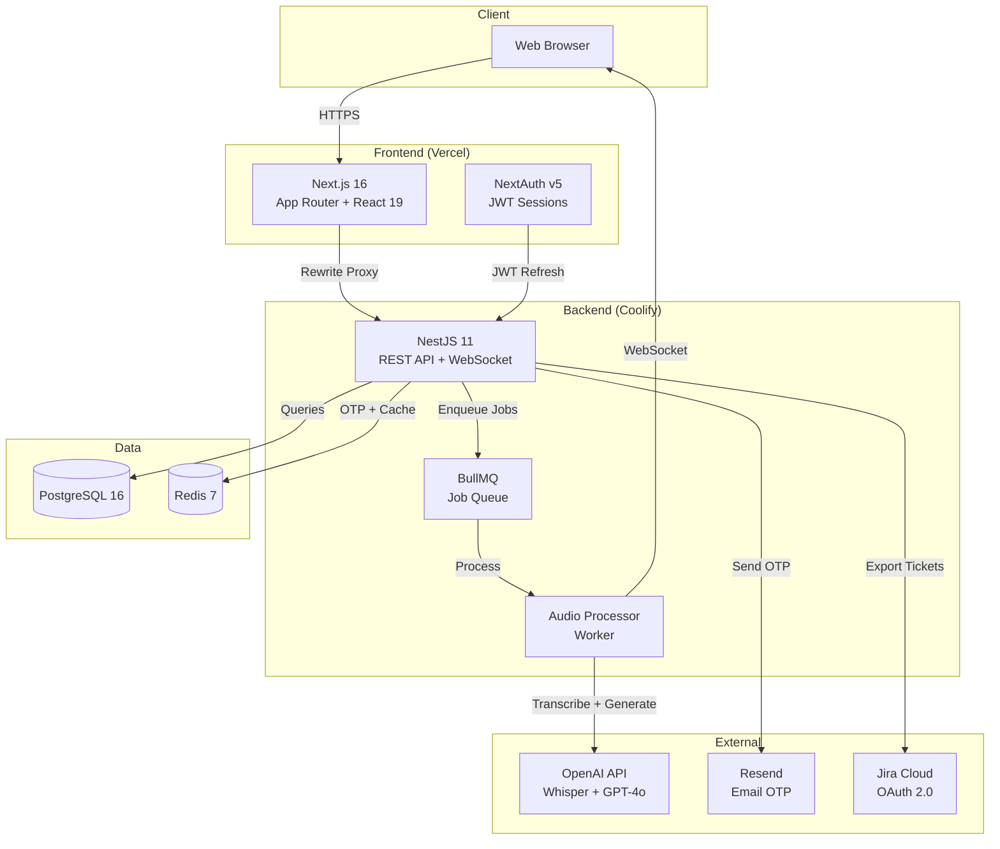
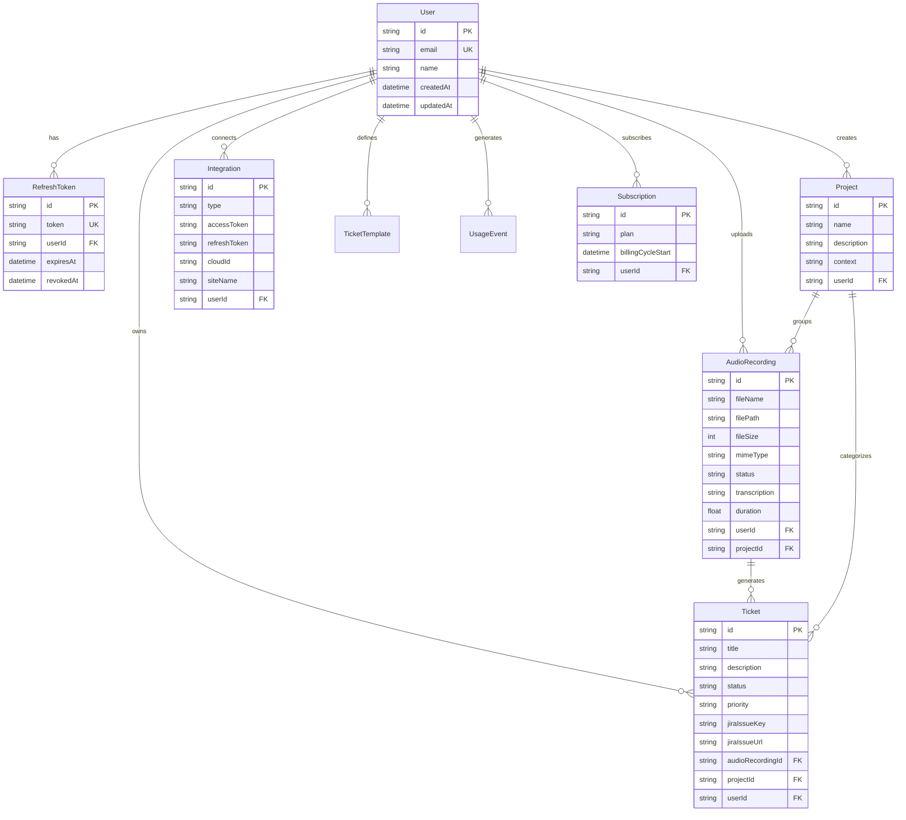
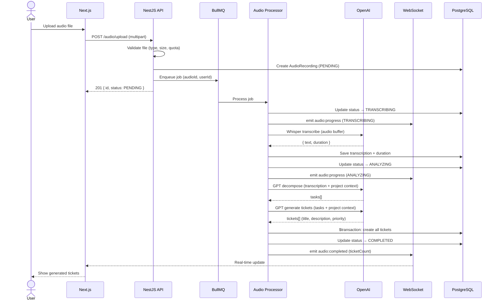
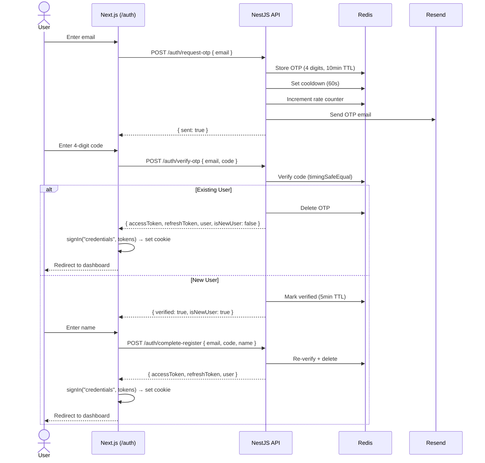
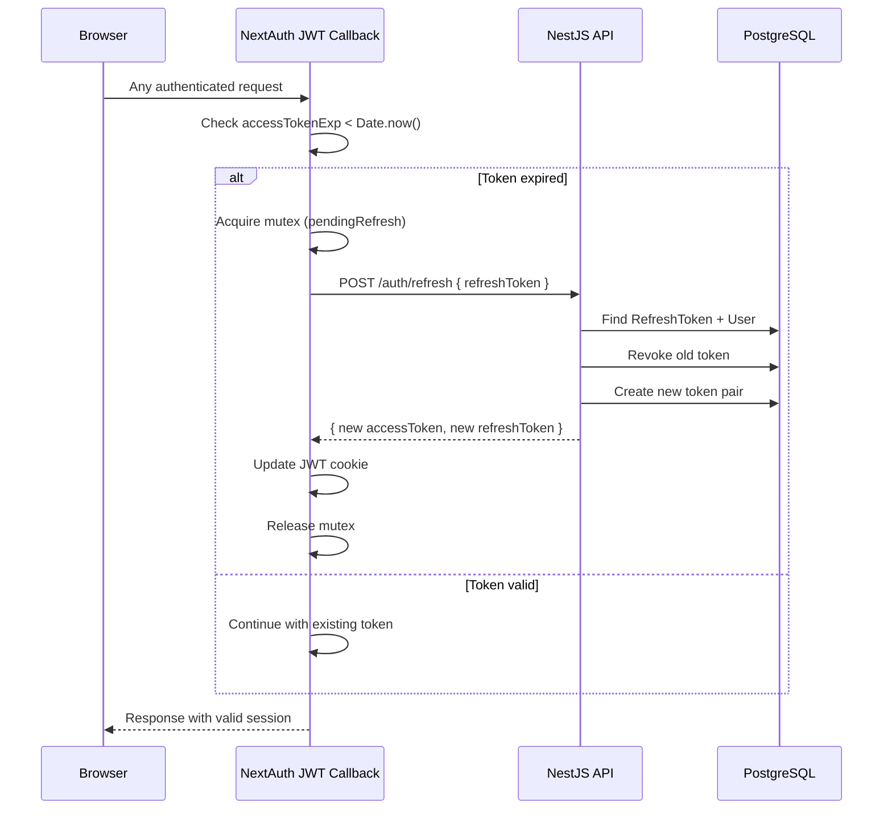
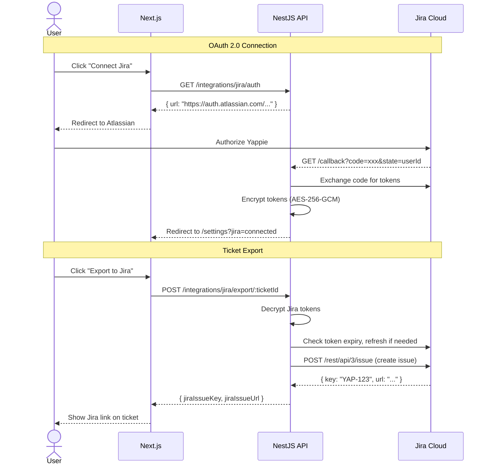
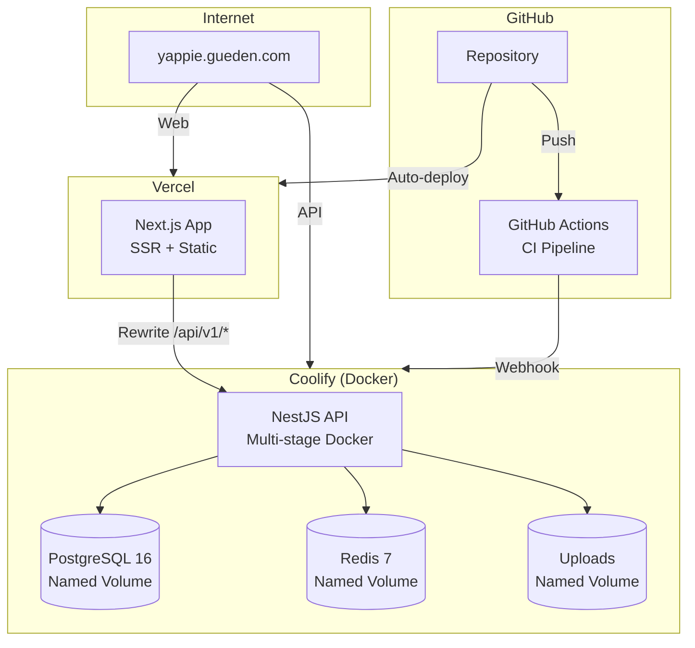
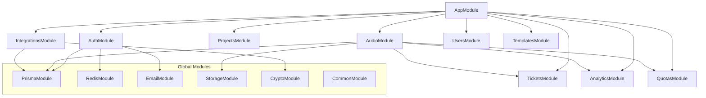
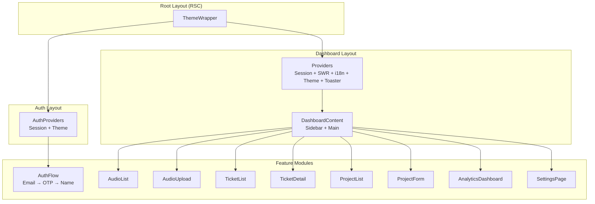

# Yappie — Architecture Documentation

## System Overview

## Data Model

## Audio Processing Pipeline

## Authentication Flow (Passwordless OTP)

## Token Refresh Flow

## Jira Integration Flow

## Deployment Architecture

## Module Dependency Graph

## Frontend Component Architecture

